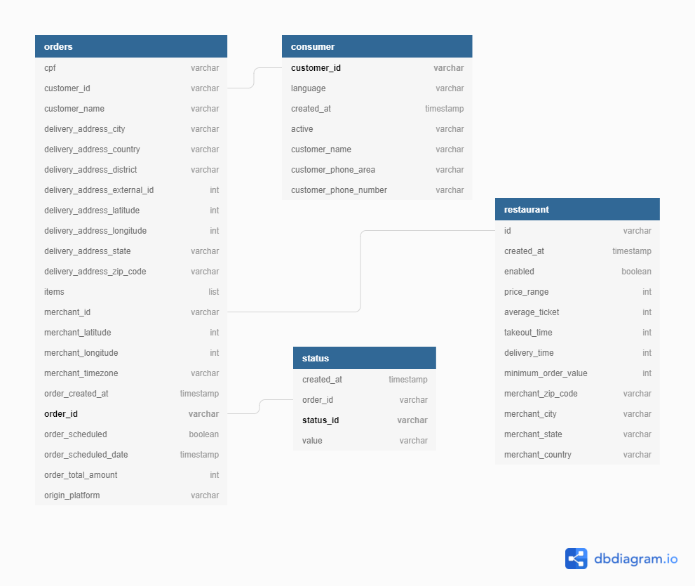

# PROJECT: DATA LAKE
## ETL LOCAL PIPELINE

### by Gerson Garcia

## 1. INTRODUCTION

### 1.1. PROJECT GOAL

- Process semi-structured data and build a datalake that provides efficient storage and
performance. The datalake must be organized in the following 2 layers:

Raw layer: Datasets must have the same schema as the source, but support fast structured
Data reading
Trusted layer: Datamarts as required by the analysis team

I made this prototype of datalake on my local machine

### 1.2. PROJECT WORKFLOW

- Build the ETL process step-by-step using Jupyter notebook `etl.ibynb`. Using donwloaded data for building the ETL process on my local machine
- Build the ETL in a .py file using docker and Pyspark

### 1.3.  ANALYZING RAW LAYER SCHEMA 

After exploring the datasets of JSON and CVS I made a diagram to figure it out the approach to transform the data to the datamarts (trusted layer)
Fields in **bold**: primary keys.

(ERD diagram was made by using https://dbdiagram.io/)

## 2. MORE DETAILS ABOUT THE PROJECT PROCESS

### 2.1. STRUCTURE OF THE PROJECT

**This project I did it in 2 parts:**

1. A Jupyter notebook  `etl.ipynb`, where i build the ETL process step-by-step using Jupyter notebook on sample data in local directory

2. Put all the codes together to build the script `etl.py` and run on docker (Spark local mode), testing both the local data and a subset of data

(The details of the workflow are in the `elt.py` itself)

### 3.2. SOME IMPORTANT NOTES ABOUT THE PROJECT

#### DATA COMPLEXITY

- The file order data has 10 gziped. The average size of each file is GB: 1.10 
- The file status has 1 gziped file. The total size of the file, GB: 1.67
- The file consumer has 1 gziped file. The total size of the file, MB: 73.77
- The file restaurant has 1 gziped file. The total size of the file, MB: 0.76

## 4. AUTHORS

* **Gerson Garcia** 

## 4. ACKNOWLEDGEMENTS

* This project was created as a requirement for a Data Engineering position

## Folder Organization

    ├── README.md                   <- README file.
    │
    ├── img                         <- Folder for storing media
    │
    ├── dev                         
    │   ├── Dockerfile              <- Defines docker container and installs dependencies
    │   └── requirements.txt        <- Stores Python required libraries.
    │
    ├── data                        <- Shared volume with docker container.
    │   ├── raw                     <- Raw data (First step in the datalake) - will be created with the script
    │   ├── trusted                 <- Trusted data (First step in the datalake) - will be created with the script
    │   └── etl.py                  <- Script that contains the ETL
    │
    ├── .gitignore                  <- Used for ignoring uploading unecessary data to repo.
    │
    └── docker-compose.yml          <- Docker-compose file for runing docker containers with environemnt specs.